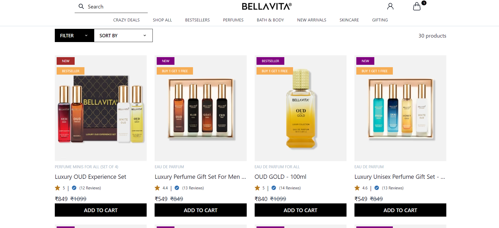
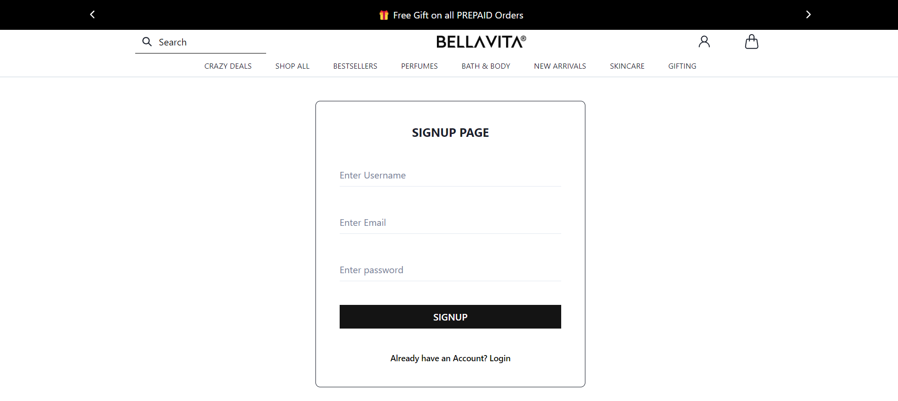
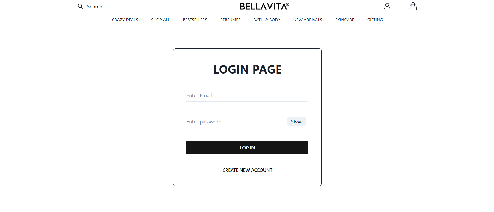
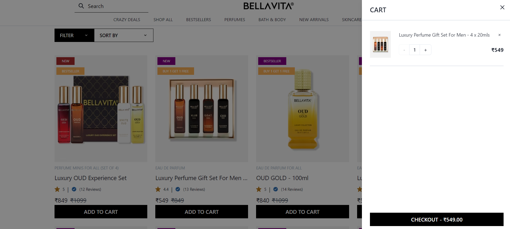

# Project Title:
## REACT BELLAVITA CLONE

## [Link to React Bellavita clone](https://react-bellavita-clone.netlify.app/)

```This is a clone of the Bellavita website, where I have used React, React-Router, Context API, Axios, and Chakra UI for the frontend, and json-server for the backend. The project is deployed on Netlify. In this project, I have implemented login and logout functionality, cart functionality, and several product pages.```

## Screenshots

### Homepage


### Product Page


### Signup Page


### Login Page


### Cart Page


## Acknowledgments


